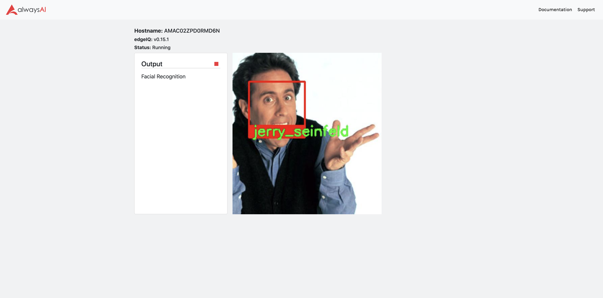
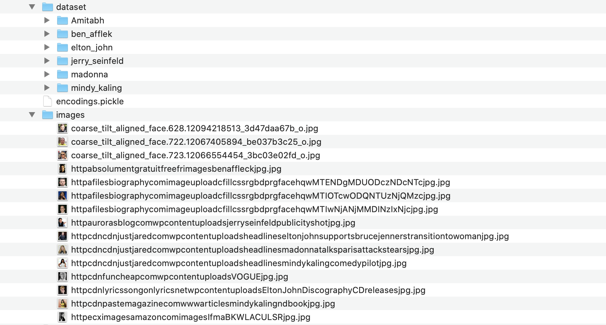

# Facial Recognition
This alwaysAI app does facial detection and recognition. It uses this [python library](https://pypi.org/project/face-recognition/) which is based on the dlib library.



## Requirements
- [alwaysAI account](https://alwaysai.co/auth?register=true)
- [alwaysAI CLI tools](https://dashboard.alwaysai.co/docs/getting_started/development_computer_setup.html)

Clone this repo into a local directory. Then cd into the `facial_recognition` folder and run `aai app configure` and make the following selections:
- When prompted to choose a project, use the down arrow and select `Create new project`, choosing any name you like.
- When prompted to create `alwaysai.project.json`, select `Yes`

The `app.py` and `alwaysai.app.json` files should be automatically detected and you should not need to create them.

You can find details on working with projects [here](https://alwaysai.co/docs/getting_started/working_with_projects.html).

### Using Facial Recognition App

Before running the app, you need to prepare the dataset of the people you want to recogise. For the purpose of simplicity, I am using a [kaggle-dataset](https://www.kaggle.com/dansbecker/5-celebrity-faces-dataset). Just copy the folders from the `train` directory into the dataset folder.
You could also create your own set by collecting around 8-10 images of a person and copy into a folder with the name into the dataset folder.
Copy the images from the `val` directory into the `images` directory for testing.You could also download images from the internet and put into the images folder.Next, cd into the `scripts` directory and run `make`. It would generate `encodings.pickle` which is the database of the known people.

```
% make
docker build --build-arg UID=502 --build-arg GID=20 -t facial-recognition-dataset-creator .
Sending build context to Docker daemon  6.144kB
Step 1/12 : FROM jjanzic/docker-python3-opencv
 ---> 7b19919b069b
Step 2/12 : RUN pip install dlib face_recognition imutils
 ---> Using cache
 ---> 306086a11ea4
Step 3/12 : WORKDIR /srv
 ---> Using cache
 ---> 91ffd65e9c11
Step 4/12 : ARG UNAME=ocvuser
 ---> Using cache
 ---> 66e791a6dfa7
Step 5/12 : ARG UID=1000
 ---> Using cache
 ---> e606df4aee61
Step 6/12 : ARG GID=1000
 ---> Using cache
 ---> 0c7f193b08cb
Step 7/12 : RUN groupadd -g $GID -o $UNAME
 ---> Using cache
 ---> da6c192b567a
Step 8/12 : RUN useradd -m -u $UID -g $GID -o -s /bin/sh $UNAME
 ---> Using cache
 ---> 78ca1ae1b8cd
Step 9/12 : ENV method=hog
 ---> Using cache
 ---> c8976d20ad46
Step 10/12 : USER $UNAME
 ---> Using cache
 ---> 0334c3004f05
Step 11/12 : ADD *.py *.xml /srv/
 ---> abc62ebefa91
Step 12/12 : CMD [ "python3", "/srv/encode.py", "-i", "/srv/dataset", "-e", "/srv/model/encodings.pickle", "-d", "${method}" ]
 ---> Running in fd29130e7f37
Removing intermediate container fd29130e7f37
 ---> cd9ab7d99083
Successfully built cd9ab7d99083
Successfully tagged facial-recognition-dataset-creator:latest
docker run -it -v /Users/abhijeet.bhatikar/AAI/Project/aai_facialrecognition/facial_recognition/scripts/../dataset:/srv/dataset -v /Users/abhijeet.bhatikar/AAI/Project/aai_facialrecognition/facial_recognition/scripts/../:/srv/model -e method=hog facial-recognition-dataset-creator:latest
[INFO] quantifying faces...
[INFO] processing image 1/105 - /srv/dataset/Amitabh/images (2).jpeg
[INFO] processing image 2/105 - /srv/dataset/Amitabh/download.jpeg
[INFO] processing image 3/105 - /srv/dataset/Amitabh/images (4).jpeg
...
...
...
...
...
...
[INFO] processing image 96/105 - /srv/dataset/jerry_seinfeld/httpgraphicsnytimescomimagessectionmoviesfilmographyWireImagejpg.jpg
[INFO] processing image 97/105 - /srv/dataset/jerry_seinfeld/httpwwweonlinecomresizewwweonlinecomeolimagesEntireSitersxjerryseinfeldjulialouisdreyfusjwjpg.jpg
[INFO] processing image 98/105 - /srv/dataset/jerry_seinfeld/httpstatictherichestimagescomcdncwpcontentuploadsJerrySeinfeldjpg.jpg
[INFO] processing image 99/105 - /srv/dataset/jerry_seinfeld/httpwwwwatchidcomsitesdefaultfilesuploadsightingBreitlingwatchJerrySeinfeldjpg.jpg
[INFO] processing image 100/105 - /srv/dataset/jerry_seinfeld/httpimagescontactmusiccomnewsimagesjerryseinfeldjpg.jpg
[INFO] processing image 101/105 - /srv/dataset/jerry_seinfeld/httpimagesrottentomatoescomimagesspotlightsnewsjerryseinfeldjpg.jpg
[INFO] processing image 102/105 - /srv/dataset/jerry_seinfeld/httpsrobertaccetturacomwpcontentuploadsjerryseinfeldheadshotjpg.jpg
[INFO] processing image 103/105 - /srv/dataset/jerry_seinfeld/httppfodcompchannelslegacyprofilejerryseinfeldpodcastjpg.jpg
[INFO] processing image 104/105 - /srv/dataset/jerry_seinfeld/httpikinjaimgcomgawkermediaimageuploadsWmIuhdsrcedidjpgjpg.jpg
[INFO] processing image 105/105 - /srv/dataset/jerry_seinfeld/httpsuploadwikimediaorgwikipediacommonsthumbbJerrySeinfeldjpgpxJerrySeinfeldjpg.jpg
[INFO] serializing encodings...
```


## Running
This app can be built and run as any other alwaysAI application. For general information on running apps, please see https://alwaysai.co/blog/building-and-deploying-apps-on-alwaysai 

```
% aai app install
⚠ Application has no models
✔ Install python virtual environment
✔ Install python dependencies

% aai app start
status loading encodings + face detector...
Images:
['images/coarse_tilt_aligned_face.628.12094218513_3d47daa67b_o.jpg', 'images/coarse_tilt_aligned_face.722.12067405894_be037b3c25_o.jpg', 'images/coarse_tilt_aligned_face.723.12066554454_3bc03e02fd_o.jpg', 'images/httpabsolumentgratuitfreefrimagesbenaffleckjpg.jpg', 'images/httpafilesbiographycomimageuploadcfillcssrgbdprgfacehqwMTENDgMDUODczNDcNTcjpg.jpg', 'images/httpafilesbiographycomimageuploadcfillcssrgbdprgfacehqwMTIOTcwODQNTUzNjQMzcjpg.jpg', 'images/httpafilesbiographycomimageuploadcfillcssrgbdprgfacehqwMTIwNjANjMMDINzIxNjcjpg.jpg', 'images/httpaurorasblogcomwpcontentuploadsjerryseinfeldpublicityshotjpg.jpg', 'images/httpcdncdnjustjaredcomwpcontentuploadsheadlineseltonjohnsupportsbrucejennerstransitiontowomanjpg.jpg', 'images/httpcdncdnjustjaredcomwpcontentuploadsheadlinesmadonnatalksparisattackstearsjpg.jpg', 'images/httpcdncdnjustjaredcomwpcontentuploadsheadlinesmindykalingcomedypilotjpg.jpg', 'images/httpcdnfuncheapcomwpcontentuploadsVOGUEjpg.jpg', 'images/httpcdnlyricssongonlyricsnetwpcontentuploadsEltonJohnDiscographyCDreleasesjpg.jpg', 'images/httpcdnpastemagazinecomwwwarticlesmindykalingndbookjpg.jpg', 'images/httpecximagesamazoncomimagesIfmaBKWLACULSRjpg.jpg']

[INFO] Streamer started at http://localhost:5000
```

Open the link in a browser on your machine to start the facial recognition app.
